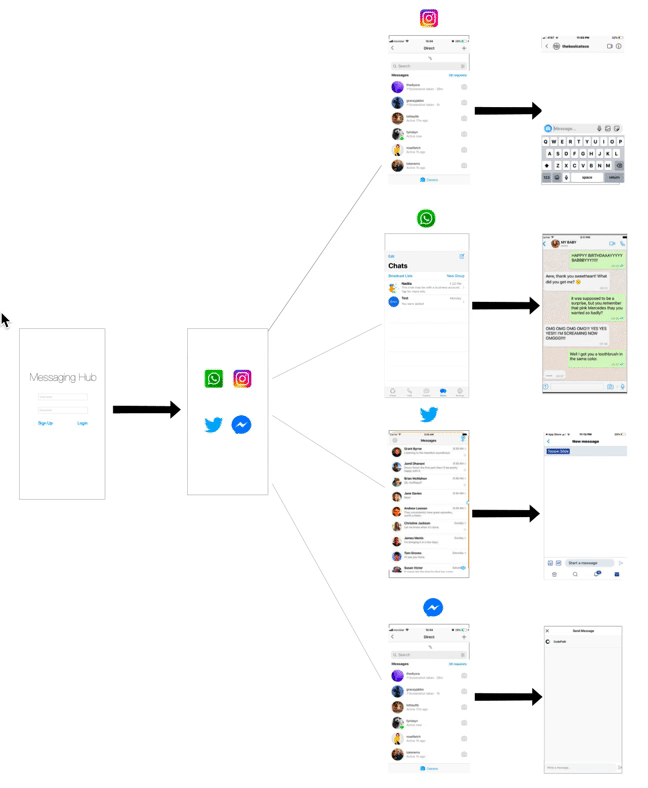

# **Group Project - README**
# Messaging-Hub

## Table of Contents
1. [Overview](#Overview)
1. [Product Spec](#Product-Spec)
1. [Wireframes](#Wireframes)
2. [Schema](#Schema)

## Overview
### Description
All in one messaging hub using API calls to WhatsApp, Facebook messenger, Instagram and Twitter to pull DMs to display them all in one application
### App Evaluation

- **Category:** Social Networking
- **Mobile:** All device types
- **Story:** Link to multiple accounts including WhatsApp facebook instagram and twitter and access chats
- **Market:** To all individuals who use multiple social apps
- **Habit:** Convient users who have multiple social app accounts and allow them to send and reply messages.
- **Scope:** First we would let users to login to the messaging-hub, and then the user can link the social app accounts

## Product Spec

### 1. User Stories (Required and Optional)

**Required Must-have Stories**

*  User logs in with the finger print 
*  User can link their social app accounts
*  User selects social account 
*  User can start the chat

### 2. Screen Archetypes

* Login Screen
   * login to Messaging-Hub
* Home Selection Screen
    * Select the social account 
* Message Screen
   * start the chat

### 3. Navigation

**Tab Navigation** (Tab to Screen)

* Login Screen
* Home selection Screen
* List of Messages Screen
* Messages Screen

## Wireframes

### [BONUS] Digital Wireframes & Mockups

### [BONUS] Interactive Prototype

## Schema 
[This section will be completed in Unit 9]
### Models
[Add table of models]
### Networking
- [Add list of network requests by screen ]
- [Create basic snippets for each Parse network request]
- [OPTIONAL: List endpoints if using existing API such as Yelp]
