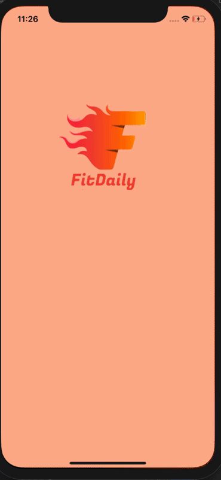

# **Group Project - README**
# FitDaily




## Table of Contents
1. [Overview](#Overview)
1. [Product Spec](#Product-Spec)
1. [Wireframes](#Wireframes)
2. [Schema](#Schema)

## Overview
### Description
A mobile app to keep track of your food and track your progress
### App Evaluation

- **Category:** Social Networking/health
- **Mobile:** All device types
- **Story:** Calculate caloric intake and keep track of your progress
- **Market:** For all people who are working towards a fitness goal
- **Habit:** This app could be used daily as the user wanted keeping track of their progress
- **Scope:** First we would let the user to sign up for an account, and let the user update the profile
## Product Spec

### 1. User Stories (Required and Optional)

**Required Must-have Stories**

*  Users can sign up through the app
*  Users can login to their account
*  Uses can update their information
*  Users can log out of the account 
*  Users have food diary
*  Users can check their weekly progress report
*  App calculates the daily caloric allowance
*  Users can privately chat with other users
*  Users can chat with the chat bot for health and nutrition advice
### 2. Screen Archetypes

* Login Screen
   * login to FitDaily
* Home Selection Screen
    * Select the social account 
* Message Screen
   * start the chat

### 3. Navigation

**Tab Navigation** (Tab to Screen)

* Login Screen
* Home selection Screen
* List of Messages Screen
* Messages Screen


## Wireframes


### [BONUS] Digital Wireframes & Mockups

### [BONUS] Interactive Prototype

## Schema 
[This section will be completed in Unit 9]
### Models
Data Models:


 | Property      | Type     | Description |
   | ------------- | -------- | ------------|
   | author        | Pointer to User|  Name / profile image of author recipient |
   | object        | String   | Unique id for each message |
   | CreatedAt       | DateTime | Date / Time when a message is sent |
   | MessagesCount | Number   | Number of messages inside of a conversation|
   | objectId    | String   | Unique id for the user |


### Networking
#### List of network requests by screen
 
### Facebook

 > login
  ```swift
  (void)viewDidLoad {
  [super viewDidLoad];
    if ([FBSDKAccessToken currentAccessToken]) {
       // TODO:Token is already available.
     }
  }
   // ....
FBSDKLoginManager *loginManager = [[FBSDKLoginManager alloc] init];
[loginManager logInWithReadPermissions:@[@"email"]
                    fromViewController:self
                               handler:^(FBSDKLoginManagerLoginResult *result, NSError *error) {
  //TODO: process error or result
 }];
 ```
 >Home Message Screen
   - (Read/GET)Query all chats where user is author
       ```swift
         let query = PFQuery(className:"Messages")
         query.getObjectsInBackground { (Messages: [PFObject]?, error: Error?) in
            if let error = error { 
               print(error.localizedDescription)
            } else if let messages = messages {
               print("Successfully retrieved \(messages.count) messages.")
            }
         }
         ```
   - (Delete) Delete existing chat
      ```swift
      PFObject.deleteAll(inBackground: objectArray) { (succeeded, error) in
      if (succeeded) {
        // The array of objects was successfully deleted.
      } else {
        // There was an error. Check the errors localizedDescription.
      }
     }
 
> Chat Screen
   - (Read/Get) Query all the messages
   
   - (Create/POST) Send a new Message
   


> Receive Messages (GET direct_messages)

  - Resource URL: https://graph.facebook.com/v6.0/me/messages?access_token=<PAGE_ACCESS_TOKEN>

> Send Messages (GET direct_messages)

  - Resource URL: https://graph.facebook.com/v6.0/me/messages?access_token=<PAGE_ACCESS_TOKEN>
 

 ----------------------------------------------------------------------------------------------------------------


 ----------------------------------------------------------------
 
 
 
### Twitter
 
> Log in 
```swift
    func login(url: String, success: @escaping () -> (), failure: @escaping (Error) -> ()){
        loginSuccess = success
        loginFailure = failure
        TwitterAPICaller.client?.deauthorize()
        TwitterAPICaller.client?.fetchRequestToken(withPath: url, method: "GET", callbackURL: URL(string: "alamoTwitter://oauth"),           scope: nil, success: { (requestToken: BDBOAuth1Credential!) -> Void in
            let url = URL(string: "https://api.twitter.com/oauth/authorize?oauth_token=\(requestToken.token!)")!
            UIApplication.shared.open(url)
        }, failure: { (error: Error!) -> Void in
            print("Error: \(error.localizedDescription)")
            self.loginFailure?(error)
        })
```

> Log out
 ```
  func logout (){
        deauthorize()
    }
 ```
 
> Receive Messages (GET direct_messages)

 - Resource URL: https://api.twitter.com/1.1/direct_messages/events/show.json

> Send Messages (POST direct_messages)

 - Resource URL: https://api.twitter.com/1.1/direct_messages/events/new.json

> Delete Messages (DELETE direct_messages/events/destroy)

 - Resource URL: https://api.twitter.com/1.1/direct_messages/events/destroy.json


      
      
        


